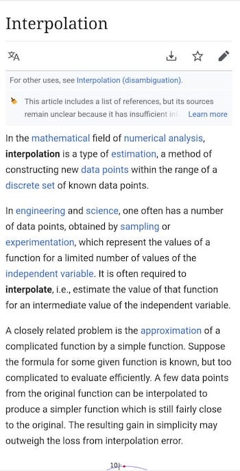

# Lines_Segregation
An algorithm which can be used to segregrate lines in an image and include the line within a rectangle. This is different from the "read method" as read will not be able to tell the co-ordinates where the line starts. This can prove to be very useful. For example: if we need to apply OCR on an image we can apply it on each line which can lead to an increase in accuracy.

If we pass the input image as following:

We will get an output as:

